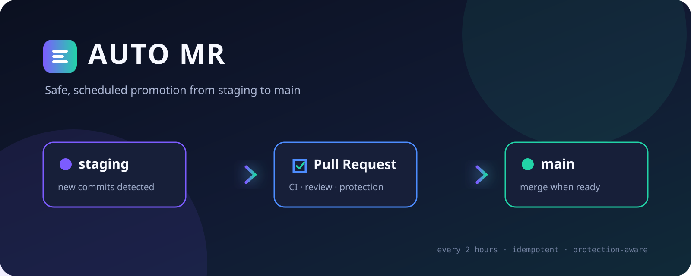

<p align="center">
  
</p>

<p align="center">
  <a href="https://github.com/Hikari-Tsai/auto-mr/actions/workflows/promote.yml"></a>
  <a href="LICENSE"></a>
  
</p>

# AUTO MR

AUTO MR 是一個集中管理的 GitHub Actions 自動化工具。它定期檢查多個 repository 的發佈 branch；當 `staging` 有尚未進入 `main` 的 commits 時，自動建立 Pull Request，並交由目標 repository 原有的 CI、人工 review、PR-Agent 與 branch protection 決定何時可以合併。

它的目的不是繞過審核，而是省下反覆建立 promotion PR、確認是否已有 PR，以及手動按下 merge 的工作。

## 運作方式

```text
每天 08:00（台北時間）／手動觸發
        │
        ▼
讀取 config/projects.yml
        │
        ▼
比較 staging 與 main
        │
        ├── 沒有新 commits ──→ no-changes
        │
        └── 有新 commits
                │
                ▼
        尋找或建立 Pull Request
                │
                ▼
        CI · PR-Agent · Review · Protection
                │
                ▼
        GitHub 允許後合併至 main
```

- 每天台北時間 08:00 執行，也能從 Actions 頁面手動觸發。
- 同一組來源與目標 branch 只維護一張 open PR。
- 尊重 required checks、required reviews、deployment gates 與 rulesets。
- 等待 CI 或人工批准不視為錯誤。
- 不修改 branch、不解衝突，也不繞過 branch protection。
- 單一專案失敗不會中斷其他專案，結果會統一顯示在 Actions summary。

## 快速開始

### 1. 建立 Fine-grained PAT

前往 [GitHub Fine-grained token 建立頁](https://github.com/settings/personal-access-tokens/new?name=auto-mr&description=Promote%20staging%20branches%20through%20pull%20requests&expires_in=90&contents=read&pull_requests=write)，設定：

| 設定 | 值 |
| --- | --- |
| Resource owner | 擁有目標 repositories 的個人帳號 |
| Repository access | `Only select repositories` |
| Contents | `Read-only` |
| Pull requests | `Read and write` |
| Metadata | `Read-only`，由 GitHub 自動提供 |

在 `Only select repositories` 中勾選每個要讓 AUTO MR 管理的 repository。Token 只顯示一次，請勿將它放入 commit、issue、設定檔或聊天訊息。

### 2. 儲存 Actions Secret

在 AUTO MR repository 開啟：

```text
Settings → Secrets and variables → Actions → New repository secret
```

填入：

```text
Name:   AUTO_MR_TOKEN
Secret: <剛才建立的 token>
```

程式只從執行環境讀取 Secret，並會遮罩錯誤訊息中的 token 格式。

### 3. 設定目標專案

編輯 [`config/projects.yml`](config/projects.yml)：

```yaml
defaults:
  source_branch: staging
  target_branch: main
  merge_method: squash

projects:
  - repository: Hikari-Tsai/twitch-bot

  - repository: Hikari-Tsai/dc-manager
    merge_method: merge

  - repository: Hikari-Tsai/temporarily-disabled
    enabled: false
```

| 欄位 | 必填 | 預設值 | 說明 |
| --- | --- | --- | --- |
| `repository` | 是 | — | GitHub 的 `owner/name` |
| `source_branch` | 否 | `staging` | 要發佈的來源 branch |
| `target_branch` | 否 | `main` | PR 的目標 branch |
| `merge_method` | 否 | `squash` | `merge`、`squash` 或 `rebase` |
| `enabled` | 否 | `true` | 設為 `false` 可暫停單一專案 |

每個啟用的專案都必須有來源與目標 branch，PAT 也必須被授權存取該 repository。Repository 必須允許設定檔指定的 merge method。

### 4. 手動驗證

開啟：

```text
Actions → Promote staging branches → Run workflow
```

執行完成後查看 job summary。若 staging 沒有領先 main，結果會是 `no-changes`，代表檢查成功且不需要建立 PR。

## Merge method 怎麼選

| 方法 | Git 歷史 | 適用情境 |
| --- | --- | --- |
| `merge` | 保留 staging 原始 commits，增加 merge commit | 長期存在、反覆 promotion 的 staging branch；推薦 |
| `squash` | 將 PR commits 合成 main 上的新 commit | 一次性 feature branch；歷史精簡 |
| `rebase` | 在 main 上重建每個 commit，不產生 merge commit | 需要線性歷史，且 commits 已整理完善 |

對長期 `staging → main` 流程，建議使用 `merge`。`squash` 或 `rebase` 會產生不同的 commit SHA；除非合併後會將 main 同步回 staging，否則後續 PR 可能再次列出舊 commits。

如果 main 的 ruleset 要求 linear history，則不能使用一般 merge commit，應使用 `squash` 或 `rebase`，並另外規劃 staging 同步策略。

## CI、PR-Agent 與人工 Review

AUTO MR 使用 Fine-grained PAT 建立 PR，因此目標 repo 的 `pull_request: opened` workflow 會正常收到事件。已安裝並監聽 PR webhook 的 PR-Agent 也能收到新 PR。

如果某個檢查必須完成後才能合併，請在目標 repository 將它設為 main 的 required status check：

```text
Repository Settings → Rules → Rulesets / Branch protection
```

只留下 comment、但沒有回報 required status check 的 PR-Agent 不會阻止 GitHub 合併。

## Native auto-merge 與定期重試

建議每個目標 repository 開啟：

```text
Settings → General → Pull Requests → Allow auto-merge
```

- 已開啟：CI 或 review 通過後，GitHub 立即合併。
- 未開啟：PR 保持 open，AUTO MR 在隔天排程重新嘗試，最多約延遲一天。

AUTO MR 不會自行修改 repository 的 auto-merge 或 branch protection 設定。

## 排程

Workflow 位於 [`.github/workflows/promote.yml`](.github/workflows/promote.yml)：

```yaml
schedule:
  - cron: "0 8 * * *"
    timezone: "Asia/Taipei"
```

此排程明確使用 `Asia/Taipei` 時區，每天早上 `08:00` 執行。GitHub 忙碌時可能稍有延遲。

## 執行結果

| Outcome | 意義 |
| --- | --- |
| `no-changes` | staging 沒有 commits 需要 promotion |
| `pr-created` | 已建立新的 PR |
| `waiting` | 等待 CI、review，或等待下一次 merge 重試 |
| `auto-merge-enabled` | 已啟用 GitHub native auto-merge |
| `merged` | PR 已合併 |
| `conflict` | branch 存在衝突，需要人工處理 |
| `failed` | 權限、branch、設定或 GitHub API 發生錯誤 |

## 常見問題

### 為什麼沒有建立 PR？

確認 staging 是否真的領先 main。沒有新的 commits 時，AUTO MR 會回報 `no-changes`。

### 為什麼顯示 404 或 Bad credentials？

確認 `AUTO_MR_TOKEN` 尚未過期，並且該 repository 已加入 Fine-grained PAT 的 repository access 清單。

### 為什麼 PR 一直沒有合併？

查看 PR merge box 中的 required checks、review、merge conflict 與 merge method 限制。若 repo 未開啟 native auto-merge，需等待下一次排程重試。

### 為什麼 PR-Agent 完成前就合併了？

PR-Agent 的結果必須設為 required status check。單純留言不會形成 GitHub merge gate。

## 本機開發

需求：Node.js 22 或更新版本。

```bash
npm ci --ignore-scripts --no-audit
npm test
npm run typecheck
npm run build
```

只有在本機對真實 repositories 執行時才需要提供 token：

```bash
AUTO_MR_TOKEN=... npm start
```

`.env`、`*.pem`、`node_modules` 與 `dist` 已被 `.gitignore` 排除；仍請避免將憑證保存在 repository 目錄中。

## Token 輪替

1. 建立具備相同 repository selection 與權限的新 token。
2. 更新 `AUTO_MR_TOKEN` Actions Secret。
3. 手動執行 workflow 驗證。
4. 成功後撤銷舊 token。

未來若需要跨 Organization，可將 Fine-grained PAT 改為 GitHub App installation token，而不必更改 promotion 流程與專案設定格式。

## License

本專案採用 [MIT License](LICENSE)。
